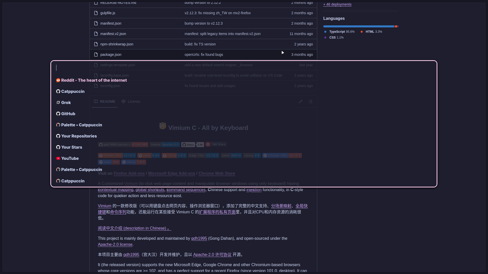
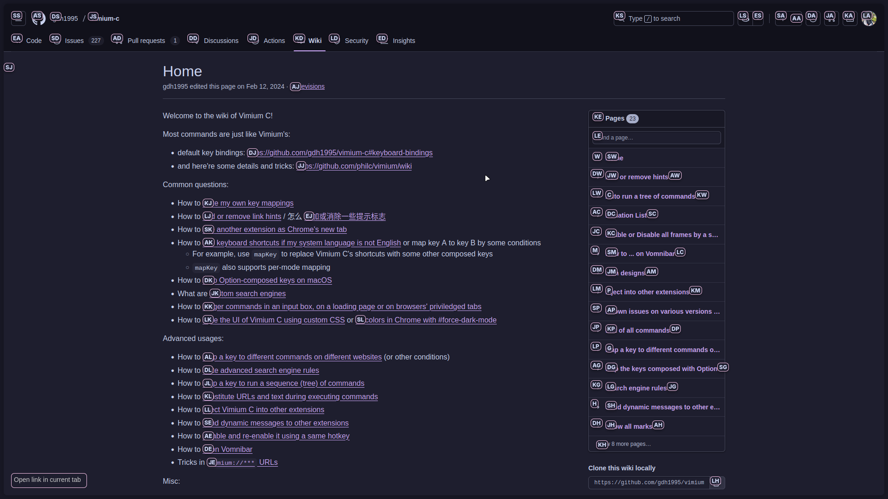
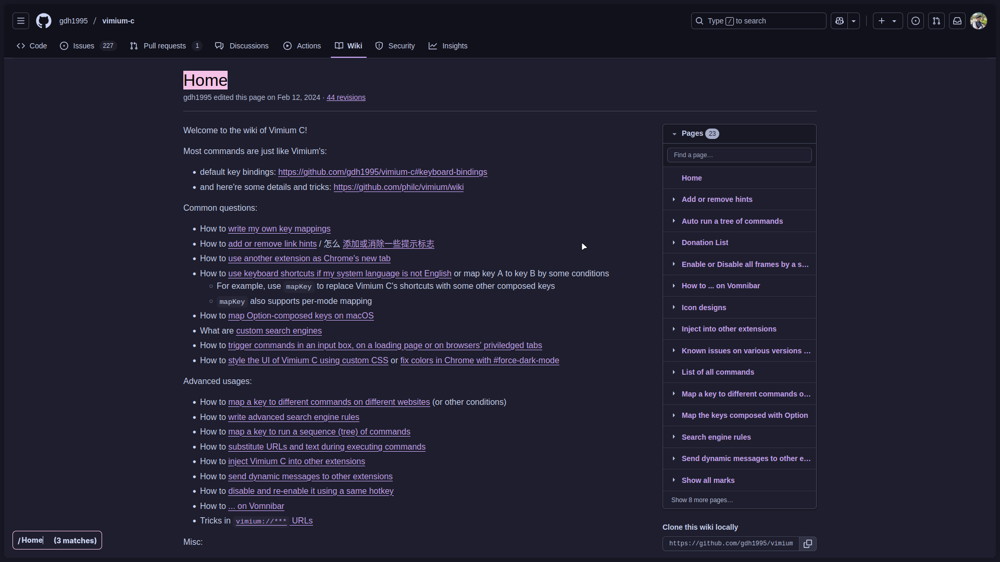

# Vimium C Catppuccin Mocha

##### Catppuccin Mocha theme for the [Vimium C](https://github.com/gdh1995/vimium-c) browser extension.

## Screenshots

Link Hint

Search

## Usage

1. Open Vimium's options page.
1. Look for the **"Custom CSS for Vimium C UI"** option.
1. Copy the contents of `catppuccin-mocha.css` into the textbox.
1. Save the changes.

## Check Other Themes

- [vimium-c-one-dark-pro](https://github.com/ascodeasice/vimium-c-one-dark-pro?tab=readme-ov-file)
- [vimiumc-themes](https://github.com/Darukutsu/vimiumc-themes#how-to-create-custom-theme-using-script)
